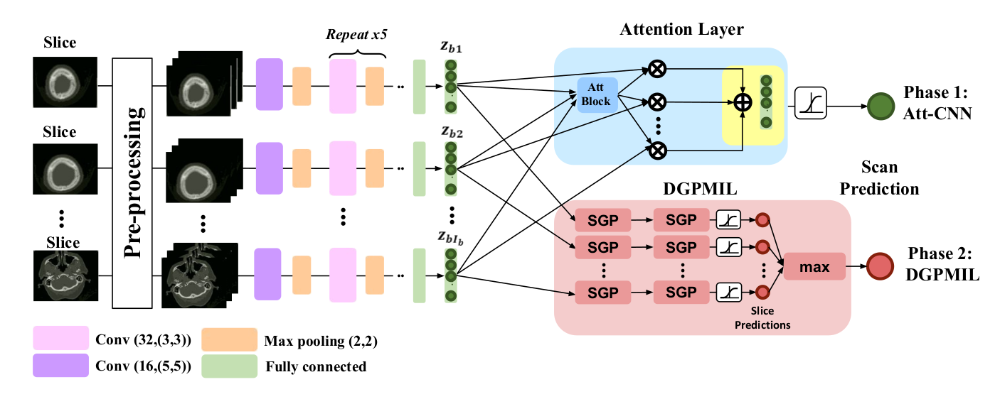

# Deep Gaussian Processes for Multiple Instance Learning (DGPMIL)

### Code for replicating the results of the paper [Deep Gaussian Processes for Multiple Instance Learning: Application to CT Intracranial Hemorrhage Detection](https://www.sciencedirect.com/science/article/pii/S0169260722001699)

#### Citation
~~~
@article{LOPEZPEREZ2022106783,
title = {Deep Gaussian processes for multiple instance learning: Application to CT intracranial hemorrhage detection},
journal = {Computer Methods and Programs in Biomedicine},
volume = {219},
pages = {106783},
year = {2022},
issn = {0169-2607},
doi = {https://doi.org/10.1016/j.cmpb.2022.106783},
url = {https://www.sciencedirect.com/science/article/pii/S0169260722001699},
author = {Miguel López-Pérez and Arne Schmidt and Yunan Wu and Rafael Molina and Aggelos K. Katsaggelos},
keywords = {Multiple instance learning, Deep Gaussian processes, Intracranial hemorrhage detection, Weakly supervised learning},
}
~~~

## Abstract
*Introduction:*\
Intracranial hemorrhage (ICH) is a life-threatening emergency that can lead to brain damage or death, with high rates of mortality and morbidity. The fast and accurate detection of ICH is important for the patient to get an early and efficient treatment. To improve this diagnostic process, the application of Deep Learning (DL) models on head CT scans is an active area of research. Although promising results have been obtained, many of the proposed models require slice-level annotations by radiologists, which are costly and time-consuming.\
*Methods:*\
We formulate the ICH detection as a problem of Multiple Instance Learning (MIL) that allows training with only scan-level annotations. We develop a new probabilistic method based on Deep Gaussian Processes (DGP) that is able to train with this MIL setting and accurately predict ICH at both slice- and scan-level. The proposed DGPMIL model is able to capture complex feature relations by using multiple Gaussian Process (GP) layers, as we show experimentally.\
*Results:*\
To highlight the advantages of DGPMIL in a general MIL setting, we first conduct several controlled experiments on the MNIST dataset. We show that multiple GP layers outperform one-layer GP models, especially for complex feature distributions. For ICH detection experiments, we use two public brain CT datasets (RSNA and CQ500). We first train a Convolutional Neural Network (CNN) with attention mechanism to extract the image features, which are fed into our DGPMIL model to perform the final predictions. The results show that DGPMIL model outperforms VGPMIL as well as the attention-based CNN for MIL and other state-of-the-art methods for this problem. The best performing DGPMIL model reaches an AUC-ROC of 0.957 and 0.909 and an AUC-PR of 0.961 and 0.889, on the RSNA and CQ500 datasets, respectively.\
*Conclusion:*\
The competitive performance at slice- and scan-level shows that DGPMIL model provides an accurate diagnosis on slices without the need for slice-level annotations by radiologists during training. As MIL is a common problem setting, our model can be applied to a broader range of other tasks, especially in medical image classification, where it can help the diagnostic process.

 ## Description of the repo
 This repo contains the code used for the paper "Learning from crowds in digital pathology using scalable variational Gaussian processes". We include all the scripts for preprocessing the database as well as for the crowdsource classification.

The tree directory:

- [DGPMIL.py](DGPMIL.py): It contains the model implemented in GPytorch.
- [mll_mil.py](mll_mil.py): It contains the objective function to be optimized for the MIL problem.
- [run_CT.py](run_CT.py): The code for running the .
- [data](data/): It contains the extracted features from the CT scan.
- [DGPMIL_MNIST.ipynb](DGPMIL_MNIST.ipynb): It contains a quick demo on MNIST dataset which can be run in Google Colab.

## DEMO

### Run demo on MNIST

Check the notebook [DGPMIL_MNIST.ipynb](DGPMIL_MNIST.ipynb], this notebook can be run in Google Colab **without any previous installation**.

### Run the CT scan experiment

For this experiment you must install the environment provided in [environment.yaml](environment.yaml).
~~~
$ conda env create -f environment.yaml
$ conda activate pytorch
$ python run_CT.py
~~~

